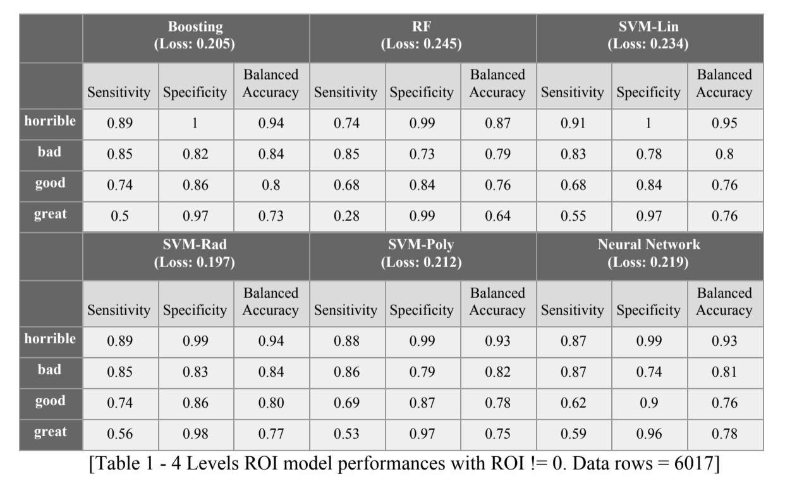
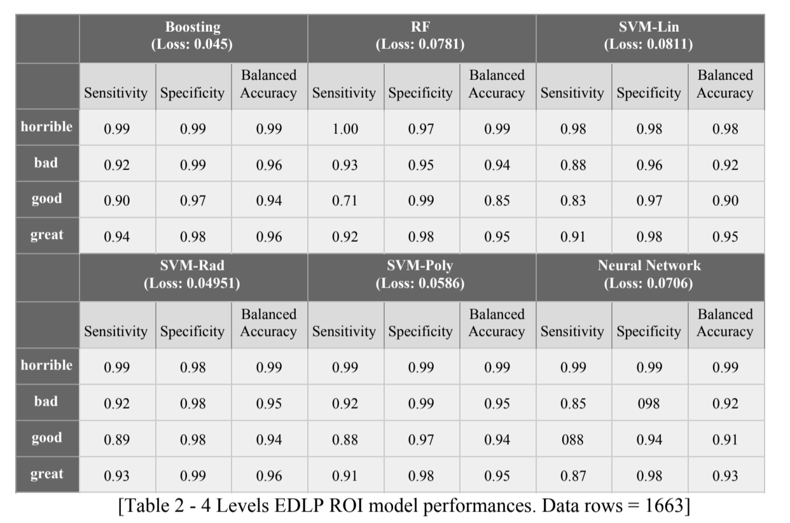

# MLSalesPred
A project in collaboration with B.L., R.P. and E.P.. The model predicted sales for 3 types of promotional activities, using sales data from 10+ retail stores in Chicago, and predicted for positive and negative return on investment (ROI) and recommended the optimal promotional method.  

#### Project Objectives
The objective of this study is to create a machine learning model that will allow the following:
1. Create a sales forecast model by retailer and product for various promotional activities
* Model the effects of promotions (e.g, Price Reduction, In-Store Display, Paper Ad) on total sales
* Include the impacts from annual seasonality as well as best weeks
2. Create a classification model for the ROI from the various promotional activities.
* Incorporate investments made by the manufacturer and paid to the retailer to run the promotions
* Level the ROI into buckets (binning)
3. Cluster optimal combination of promotional activity by product types

#### Data Overview 
The data included weekly sales information on 25+ products at four store chains, with each chain broken out into distinct regions called planning customers (15+) for different promotion types. Data for 18 months by week also included weeks when there is no promotion and where product is sold at MSRP or at a lower price for long duration (EDLP). Along with weekly sales, data set included total sales, a breakdown of total sales into base sales and incremental sales in both units and dollars. Along with sales data, the other variables included contribution margins (VCM) and estimated spending provided to the retailer to execute the promotion. The total data had over 10,000+ rows and 47 columns. 

#### Data Preparation and Cleaning 
The data was cleaned for missing values and processed by using factors, logs, and scaling. Rows with fewer than 1,000 units were eliminated to reduce variability in total sales. This was done after assessing the RMSE errors with the full dataset and finding it tending higher. Missing prices were filled in using alternate data sources. We also eliminated products (25 to 15) that had too few sales or large sets of missing information. The resulting dataset had 7,644 total rows which were separated into train and test data sets with a (60:40) ratio.   

The sales forecasting data had high variability. Therefore log(sales) was used for prediction. Promotion types and other non-numeric variables were factored. Price was not scaled as there was no significant effect on the results of normalizing price. As a result, the sales forecasting included 13 variables.  
20 features were selected for ROI modeling. A total of 6017 observations were used after taking out rows with 0 ROI. ROIs are 0 when there are no promotions in effect but the data is still recorded. We started with including these 0 ROIs, but the predicted results tended to concentrate in the zero bucket due to the imbalanced data, which is a result that is not that useful to a decision maker in this business. On the other hand, it is not reasonable to predict ROI when there is no promotion in place.  

The ROI variable is divided into 4 buckets based on absolute ROI values - ROIs < -100% (339 rows), ROIs between -100 and 0% (3395 rows), ROIs between 0 and 100% (1880 rows), and ROIs greater than 100% (403 rows). In this way of division, even though the data were not distributed evenly in each bucket, the performances are better than an evenly division approach. 

#### Modeling ROI: Preparation for Model Development 
Since our objective was to find a model that performs as well or better than traditional methods, we decided to consider different model types and compare the performance against each other to identify the best model. Based on the popular practices in the field for multi-class classification problems, the models we tested are Gradient Boosting Model, Random Forest, Support Vector Machines and Feed Forward Neural Network 

##### Modeling ROI: Evaluating Model Performance 
1. Random Forest 
Random forest is an ensemble method that uses bootstrap to learn a collection of trees and takes the average prediction of this collection of trees . We tested 1 the random forest model and found the optimal number of trees by plotting the out of bag error rate. Using ntree = 178, mtry = 5 (Number of variables available for 
splitting at each tree node) and nodesize = 50, the random forest model gives a misclassification rate of 0.245.

2. Gradient Boosting Machine 
The core idea of Gradient Boosting is also to combine multiple trees to train models. For each fit, gradient boosting focuses on adaptively modeling the residuals, so these toughest data points can better fit. Until the loss does not change anymore, gradient boosting returns an ensemble model. Boosting allows flexible definition of loss functions. In our case, we use the built in “multinomial” type in R’s gbm package, which uses misclassification rate as the default loss function for multi-class classification. The parameters we tested the model on are tdepth(number of splits of each tree), ntree (number of trees) and shrink (learning rate when boosting fit the residuals). The best performer is when tdepth = 4, ntree = 500 and shrink = 0.1, with a misclassification rate of 0.201. 

3. SVM 
An SVM performs classification tasks by constructing optimal hyperplanes (separating lines) in a multidimensional space that separates cases of different class labels. In cases where data distribution is non-linear, instead of constructing a complex curve for data separation, SVM transforms the data to higher dimensions with a function called “kernels”. In these higher dimensions, SVM will be able to separate the data linearly.

Here we explored three types of kernels: linear, radial and polynomial. The linear kernel performs the worst as expected. For the radial kernel, we tried a combination of cost and gamma to find the best parameter. Cost = 5 and gamma = 0.1 gives the best result at an error of 0.197. Similarly, we tried a combination of costs and degrees for the polynomial kernel. The best performer is at cost = 100 and degree = 2 , with a misclassification rate of 0.212. 

4. Feed-forward Neural Network 
Lastly, we ran a feed-forward neural network on the leveled ROI model. Even though hard to interpret, neural networks often would produce good results that are tolerant to noise and able to capture complex signals. Essentially, through multiple layers, Feed-forward Neural Network learns to approximate the ultimate output function. In our model, given the small size of our dataset, we only use one layer in between the input and output layer to avoid overfitting. The layer has 128 neurons with a drop out rate of 0. The misclassification rate is 0.219. 

As shown in Table 1 below, SVM with the radial kernel gives the best misclassification rate for the ROI model. Boosting had a very similar performance to the SVM radial model. Since the SVM radial model had a higher True Positive (sensitivity) rate and True Negative (Specificity) rate for “great”, we believe it does a better job at predicting for “great” ROI scenarios. Therefore, the SVM radial is the best ROI classifier. 

[Table 1]

The boosting model performed better when we only looked at the EDLP ROI subset of data (See Table 2). EDLP ROI is only calculated when there are no other promotions being conducted and only EDLP (Every Day Low Price) activity is in place. The misclassification rate was much better at 0.045 for the boosting model with most of the improvement coming from increased accuracy for the buckets in the 2 extremes. Since only 1663 rows were used in the EDLP ROI model, compared to 6017 rows for the ROI model, it is unclear whether the obtained EDLP ROI model accuracy would remain if tested on additional data. 

[Table 2]
